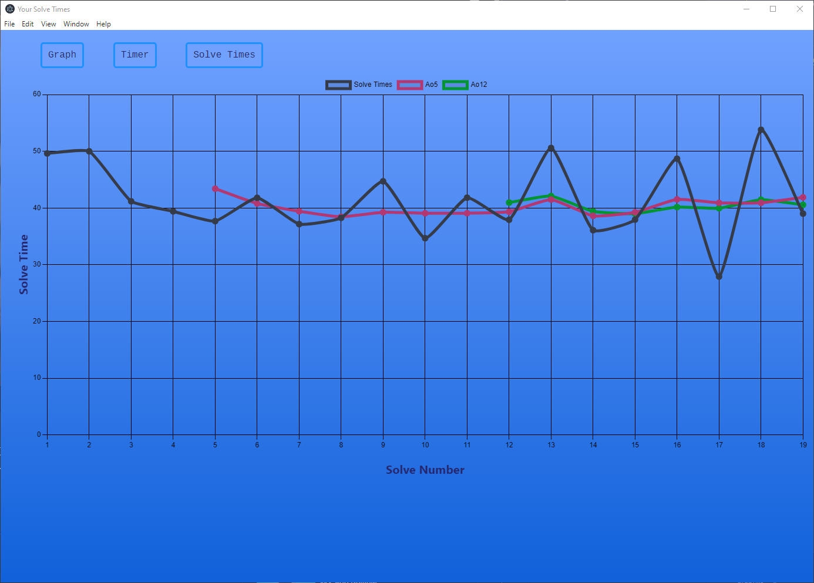

# Cube-Timer
This project aims to replicate the Android app Twisty Timer. An app meant for speedcubers to time, and track their solves all in one place.

# Objectives
* Generate randomized scrambles
* A timer to time solves
* Write and read times from a text file
* Track PBs for individual solves, and averages
* Use those times to calculate the Ao5 and Ao12 averages
* Graph the raw solve times and both averages using Chart.js

# What I learned from this project
* Used the several functions for the first time
* Source control and uploading to git
* Got more familiar with Chart.js
* First time diving deep into CSS customization
